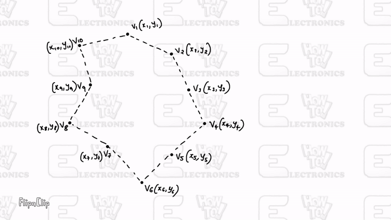

## Overview
> This is a simple demo of the Geo-fence project using GPS Module & NodeMCU ESP8266. A geo-fence is a virtual border or fence that surrounds a physical site. It forms a barrier between that site and the surrounding environment like the real fence. Unlike a physical fence, Geo-Fencing with NodeMCU ESP8266 can detect movement within the virtual fence. It can be any size or shape.

> Geofences are built with mapping software, which allows the user to build the geo-fence across the chosen geographic region. It is composed of a set of coordinates, such as latitude and longitude, or, in the case of a circular geofence, one point that serves as the center and radius

## Ponit in Polygon Algorithm
> The crucial task in Geo-fence using ESP8266 is determining whether the target is within the fence or outside. The fence could be of any shape. So we need to solve this problem by assuming that the fence is an n-dimensional polygon. Algorithm complexity also plays a crucial role in the efficiency of the tracking. Considering these concerns into account I have chosen the following algorithm for this project.

> Let’s assume that the fence created by the user is an n-dimensional polygon and we have the coordinates of all the vertices of the polygon in Vn (xn, yn) format. Let the current location of the tracking point be T (xt, yt). The below animation gives you a clear picture of how this algorithm works.
> 